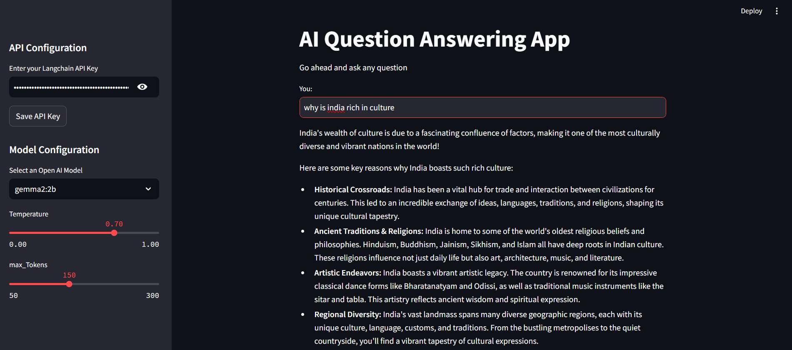
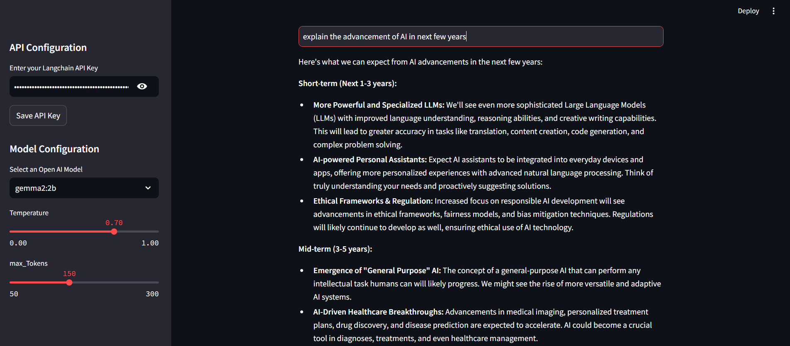
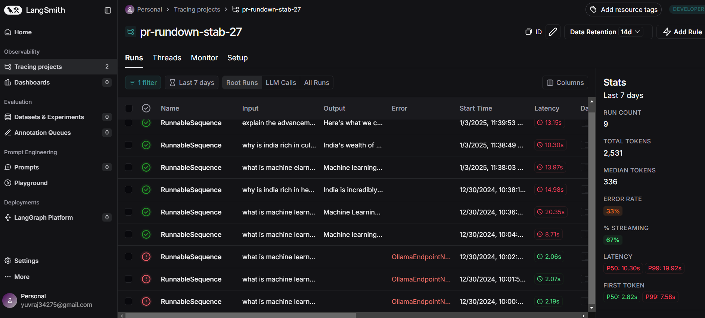

# 🧞 QueryGenie: Intelligent Question Answering with LLMs

## 🎯 About QueryGenie

QueryGenie is an advanced question-answering system powered by Large Language Models through Langchain and Ollama. It provides an intuitive interface for seamless interaction with AI models to receive intelligent, contextual responses, with secure API key management through the Streamlit interface.

### Key Features:
- **Secure API Management**: In-app API key configuration
- **Smart Interface**: Streamlit-based UI for effortless interaction
- **Model Flexibility**: Multiple Ollama model support
- **Customizable Parameters**: Adjustable temperature and token settings
- **Performance Tracking**: LangSmith integration
- **Real-time Processing**: Instant query responses

## 🔍 Project Overview

QueryGenie implements a sophisticated Q&A system using cutting-edge language models, combining advanced prompt engineering with robust model integration for accurate, contextual responses.

### 🛠️ Technical Architecture

1. **Frontend Layer**:
   - Streamlit interface with API key management
   - Dynamic parameter controls
   - Real-time responses
   - Model selection

2. **Processing Layer**:
   - Secure API key handling
   - Langchain templates
   - Ollama integration
   - Response parsing
   - LangSmith tracking

## 💻 Requirements

1. langchain-openai
2. langchain
3. langchain-community
4. langchain-core
5. streamlit

## Installation

1. Clone repository:
```bash
git clone https://github.com/Yuvraj0014/Chatbot-LLM-with-Gemma2-2b.git
cd Chatbot-LLM-with-Gemma2-2b
```

2. Setup environment:
```cmd
python -m venv venv
source venv/bin/activate  # For Linux/MacOS
venv\Scripts\activate  # For Windows
```

3. Install dependencies:
```cmd
pip install -r requirements.txt
```

4. Launch:
```cmd
streamlit run app.py
```

## Results 
Access demo:
```
simple-chatbot-llm-with-gemma2-2b-and-ollama.streamlit.app
```

## 🚀 Getting Started

1. Launch the application
2. Enter your Langchain API key in the sidebar
3. Click "Save API Key" to configure the environment
4. Select your preferred model and parameters
5. Start asking questions!

### 💻 How It Works

1. **API Configuration**:
   - Secure API key input through Streamlit
   - Environment variable configuration
   - Session state management

2. **Query Processing**:
   ```python
   # Query flow
   - API validation
   - Template formatting
   - Parameter application
   - Ollama model processing
   - Response parsing
   ```

3. **Response Generation**:
   - Model query processing
   - Temperature control
   - Token management
   - Response formatting

4. **Results Display**:
   - Clear response presentation
   - Parameter display
   - Conversation history
   - API configuration status

### 🎯 Supported Models

Currently implemented models:
- gemma2:2b

Additional models that can be integrated:
1. Llama2 Models:
   - llama2
   - llama2:13b
   - llama2:70b
2. Mistral Models:
   - mistral
   - mixtral
3. OpenHermes Models:
   - openhermes:7b
   - openhermes:mistral
4. CodeLlama Models:
   - codellama
   - codellama:13b
   - codellama:34b

### 🎯 Use Cases

- **Research**: Information access
- **Education**: Learning support
- **Documentation**: Technical understanding
- **Knowledge Base**: General queries

## 📊 System Features

- Secure API key management
- Fast response generation
- Parameter customization
- Performance monitoring
- Reliable operation
- Session state persistence

## Security Note

The application implements secure handling of API keys:
- Keys are input through a password field
- Keys are stored in session state
- Environment variables are used for runtime configuration
- No permanent storage of API keys

## 📸 Application Interface





## Tracking and Debugging



