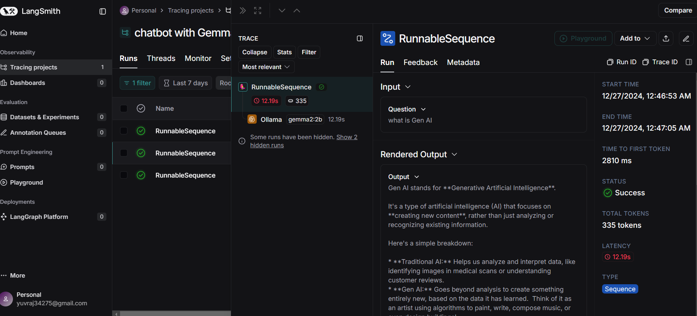

# 🌟 Langchain Chatbot with Gemma Model 🌟

## 📖 Project Overview

The **Langchain Chatbot with Gemma Model** is an intelligent chatbot application built using the LangChain framework, Streamlit for UI, and the powerful Gemma2:2b large language model from Ollama. This project demonstrates the potential of combining advanced language models with interactive user interfaces to deliver quick and accurate responses to user queries.

The chatbot is designed with a modular architecture, making it easy to extend or adapt for various use cases such as virtual assistants, customer support, or educational tools. It also leverages environment-based configurations for a secure and scalable setup.

Key Highlights:
- Seamless integration of LangChain for prompt engineering and chaining mechanisms.
- Utilization of the cutting-edge Gemma2:2b LLM to ensure high-quality answers.
- Interactive web application built using Streamlit for ease of use.

Whether you're exploring AI-powered assistants or looking to integrate language models into your workflow, this project provides a robust foundation for innovation. 🌟

---

## ✨ Features

- **🖥️ Streamlit Interface**: A sleek, interactive web interface for seamless user interaction.  
- **🤖 Gemma2 Model**: Powered by the **Ollama** LLM for precise and insightful responses.  
- **🔗 LangChain Integration**: Advanced prompt engineering and chaining for dynamic query handling.  
- **🔒 Secure Configurations**: Modular and secure setup using `.env` files for environment variables.  

---

## 🛠️ Requirements
1. langchain
2. python-dotenv
3. langchain-community
4. langchain-core
5. streamlit

---

## 🛠️ Installation and Setup

### 🔑 Prerequisites

- Python 3.7 or higher 🐍  
- [Streamlit](https://streamlit.io/) library 🌐  
- [LangChain](https://langchain.com/) library 🔗  
- Access to the **Ollama Gemma2:2b** model 🤖  

### 📦 Installation

1. Clone the Repository**:
```bash
git clone https://github.com/Yuvraj0014/Chatbot-LLM-with-Gemma2-2b.git
cd Chatbot-LLM-with-Gemma2-2b
```

2. Setup a virtual environment (optional but recommended)
```cmd
python -m venv venv
source venv/bin/activate  # For Linux/MacOS
venv\Scripts\activate  # For Windows
```

3. Install required dependencies
```cmd
pip install -r requirements.txt
```

4. Run the streamlit app
```cmd
streamlit run app.py
```

## 🌐 Usage
1. Open the application in your browser (http://localhost:8501 by default). 🌍
2. Enter a question in the input box. ❓💬
3. Receive intelligent responses from the chatbot! ⚡🤖

## 📂 Project Structure
-app.py: 💡 The heart of the project, integrating LangChain, Streamlit, and Gemma2:2b.
-.env: 🔐 Configuration file for environment variables (excluded from version control).
-requirements.txt: 📜 A list of required dependencies.

## 💻 Technologies Used
1. LangChain: 🧠 For managing and tracking language model chains.
2. Streamlit: 🌟 For building an interactive and user-friendly interface.
3. Ollama Gemma2:2b: 🤖 The brain behind the chatbot's responses.
4. Python: 🐍 The programming language that ties it all together.

## 🔍 How Output Prediction is Done

The chatbot's output prediction involves the following steps:

1. **User Input**:
   - The user types a question into the input field provided by the Streamlit application.

2. **Prompt Engineering**:
   - The question is processed using a predefined **LangChain Prompt Template**. 
   - This template includes a structured format to guide the language model, such as:
     - A **system message**: "You are a helpful assistant. Please respond to the question asked."
     - A **user message**: The actual question input by the user.

3. **Model Invocation**:
   - The processed prompt is passed to the **Gemma2:2b** model, which is accessed via the Ollama API.
   - The model generates a response by leveraging its pre-trained knowledge and reasoning capabilities.

4. **Output Parsing**:
   - The response generated by the model is parsed using the **String Output Parser** from LangChain to ensure it is in a user-friendly format.

5. **Display Results**:
   - The parsed output is displayed on the Streamlit interface, providing the user with an answer to their query.

This chain of operations ensures that the chatbot provides relevant and context-aware answers in real-time, making the interaction seamless and intuitive.


## 📜 License
This project is licensed under the MIT License. 📝
Feel free to use, modify, and share! ✨

## Output Screens and Monitoring Panel





