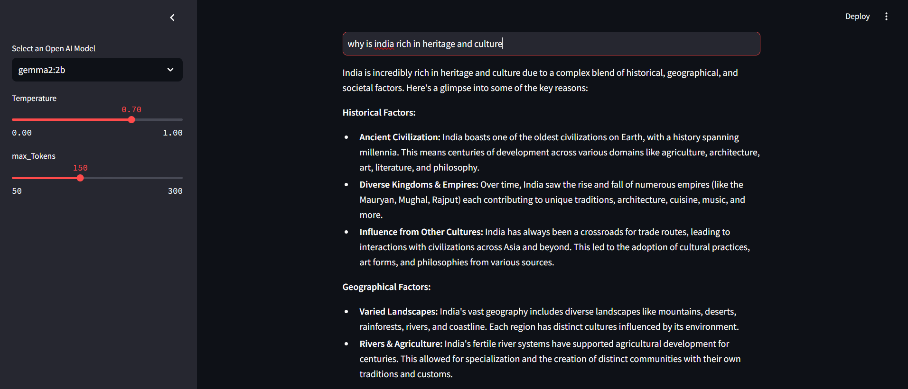
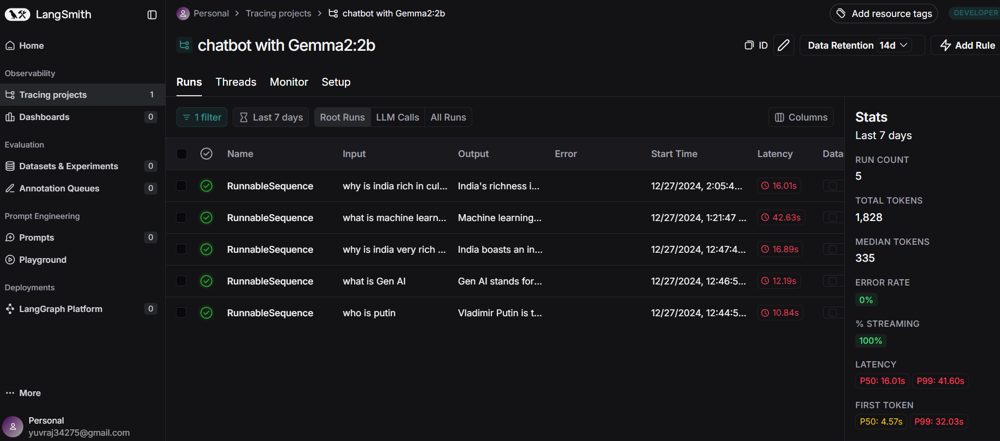
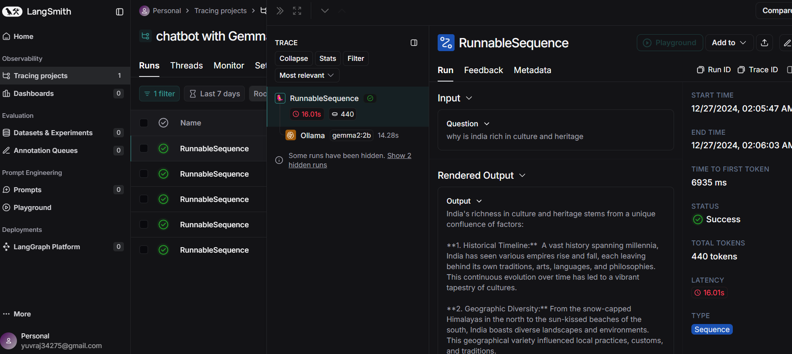

# 🧞 QueryGenie: Intelligent Question Answering with LLMs

## 🎯 About QueryGenie

QueryGenie is an advanced question-answering system powered by Large Language Models through Langchain and Ollama. It provides an intuitive interface for seamless interaction with AI models to receive intelligent, contextual responses.

### Key Features:
- **Smart Interface**: Streamlit-based UI for effortless interaction
- **Model Flexibility**: Multiple Ollama model support
- **Customizable Parameters**: Adjustable temperature and token settings
- **Performance Tracking**: LangSmith integration
- **Real-time Processing**: Instant query responses

## 🔍 Project Overview

QueryGenie implements a sophisticated Q&A system using cutting-edge language models, combining advanced prompt engineering with robust model integration for accurate, contextual responses.

### 🛠️ Technical Architecture

1. **Frontend Layer**:
   - Streamlit interface
   - Dynamic parameter controls
   - Real-time responses
   - Model selection

2. **Processing Layer**:
   - Langchain templates
   - Ollama integration
   - Response parsing
   - LangSmith tracking

## 💻 Requirements

1. langchain-openai
2. langchain
3. python-dotenv
4. langchain-community
5. langchain-core
6. streamlit

## Installation

1. Clone repository:
```bash
git clone https://github.com/Yuvraj0014/Chatbot-LLM-with-Gemma2-2b.git
cd Chatbot-LLM-with-Gemma2-2b
```

2. Setup environment:
```cmd
python -m venv venv
source venv/bin/activate  # For Linux/MacOS
venv\Scripts\activate  # For Windows
```

3. Install dependencies:
```cmd
pip install -r requirements.txt
```

4. Launch:
```cmd
streamlit run app.py
```

## Results 
Access demo:
```
querygenie.streamlit.app
```

### 💻 How It Works

1. **Query Processing**:
   - User input through Streamlit
   - Processing via Langchain template
   - Parameter application

2. **Processing Steps**:
   ```python
   # Query flow
   - Template formatting
   - Parameter application
   - Ollama model processing
   - Response parsing
   ```

3. **Response Generation**:
   - Model query processing
   - Temperature control
   - Token management
   - Response formatting

4. **Results Display**:
   - Clear response presentation
   - Confidence indicators
   - Parameter display
   - Conversation history

### 🎯 Output Interpretation

1. **Direct Responses**:
   ```
   Question: What is artificial intelligence?
   Response: [Generated explanation with parameters]
   ```

2. **System Info**:
   ```
   📊 Parameters
   Model: gemma2:2b
   Temperature: 0.7
   Max Tokens: 150
   ```

### 🎓 Use Cases

- **Research**: Information access
- **Education**: Learning support
- **Documentation**: Technical understanding
- **Knowledge Base**: General queries

## 📊 System Performance

Features:
- Fast response generation
- Parameter customization
- Performance monitoring
- Reliable operation

## 📸 Application Interface
[Interface screenshot placeholder]

## 🎯 Output Screen




## Tracking and Debugging


